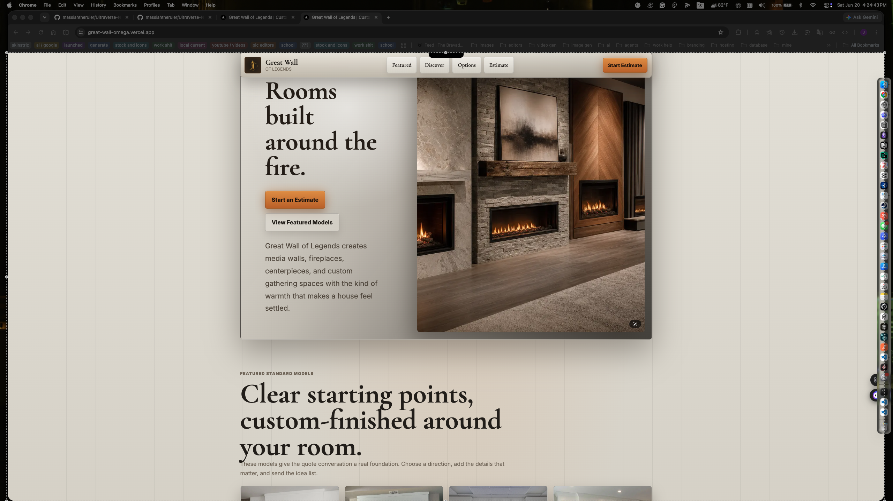
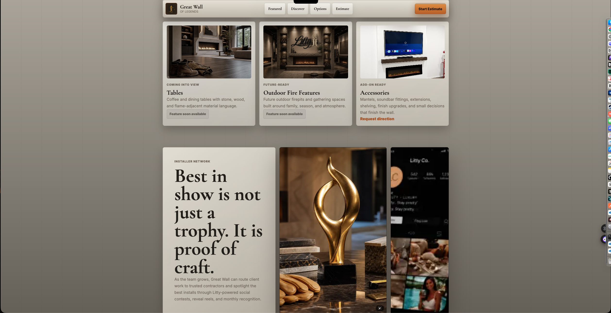
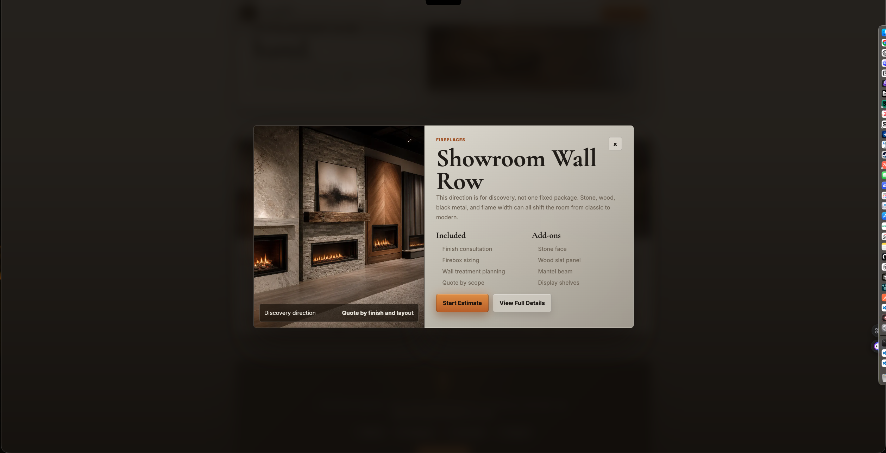
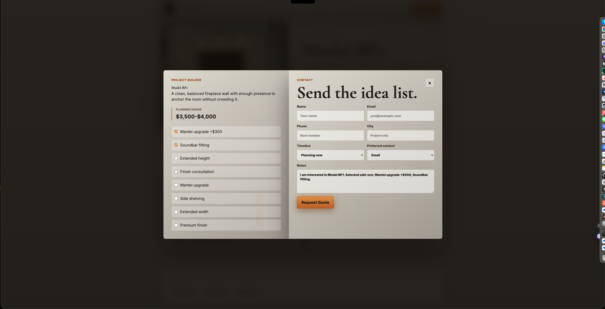

Great Wall of Legends

Great Wall of Legends is a luxury showroom-style web platform built for a real client project within the Litty brand ecosystem. The business focuses on custom media walls, fireplaces, entertainment centers, and architectural gathering spaces designed to become focal points within a home.

Rather than building a traditional brochure site, I approached the project as a scalable product experience. The goal was to create a system that could showcase products, support future categories, guide users through discovery, and generate qualified quote requests without requiring a complete rebuild as the business grows.

The result is a branded showroom experience that combines catalog browsing, dynamic product pages, quote generation, filtering, and interactive product exploration inside a modern React application.

Live Demo

[Live Demo: great-wall-omega.vercel.app](https://great-wall-omega.vercel.app/)

Project Preview

The screenshots below show the main client-facing flow: the branded first impression, product browsing, quick-view exploration, and quote request experience.

⸻

Key Features

Product Discovery

* Featured product catalog
* Dynamic product detail pages
* Category-based filtering
* Custom discovery and inspiration sections
* Quick-view product previews without leaving the browsing flow

Quote & Lead Generation

* Interactive estimate builder
* Model-aware quote requests
* Optional add-on selection
* Timeline and project preference collection
* EmailJS-powered quote delivery
* Mailto fallback when EmailJS is unavailable

User Experience

* Luxury showroom-inspired presentation
* Scroll-based reveal animations
* Responsive mobile-first layouts
* Smooth modal interactions
* Persistent browsing context throughout the quote flow

Brand Architecture

* Separate brand identity while remaining connected to the larger Litty ecosystem
* Structured content system designed to support future product lines
* Flexible catalog architecture for standard products, custom builds, and future offerings

⸻

Tech Stack

Frontend

* Next.js 16 App Router
* React 19
* TypeScript
* Tailwind CSS 4

Services

* EmailJS
* Dynamic route generation
* Custom modal management
* Structured catalog data layer

Deployment

* Vercel

⸻

Architecture Highlights

This project was intentionally structured more like a product platform than a static marketing site.

Dynamic Catalog System

Instead of hardcoding individual product pages, product information is generated from a centralized catalog structure.

This approach allows new products, categories, pricing information, and future offerings to be added without rebuilding the application architecture.

Reusable Modal Infrastructure

The quick-view and estimate experiences share a reusable modal system that manages:

* Product context
* Selected options
* Scroll locking
* Transition timing
* Portal rendering

This keeps interactions consistent across the application while avoiding duplicate logic.

Quote Pipeline Design

The estimate system was designed to collect useful project information rather than simply redirecting users to a generic contact form.

Quote requests can include:

* Selected product model
* Project timeline
* Add-on preferences
* Contact preferences
* Additional project notes

This creates a more meaningful handoff between website visitor and business owner.

Scalable Product Architecture

The application separates:

* Featured products
* Discovery content
* Future product categories
* Custom project inquiries
* Pricing guidance

This structure allows the business to expand into additional offerings without redesigning the entire platform.

⸻

Engineering Challenges

The most interesting challenge was balancing a premium visual experience with practical usability.

Many luxury-focused websites prioritize appearance at the expense of navigation and conversion. My goal was to create an experience that felt elevated while still making it easy for users to compare products, explore options, and request estimates.

The quote workflow required the most product thinking. Rather than relying on a generic “Contact Us” button, I built an estimate builder that preserves product context and allows users to configure project details before submitting an inquiry.

The catalog system also required careful planning. Products needed to support categories, pricing information, custom options, future expansions, and filtered browsing without creating a collection of one-off pages and duplicated data.

Finally, I wanted the visual identity to feel distinct from the typical startup aesthetic. The design system uses custom typography pairings, motion patterns, gradients, texture cues, and warm architectural color palettes to reinforce the brand’s positioning while remaining performant and maintainable.

⸻

Why This Project Stands Out

This project goes beyond a traditional marketing website.

It combines:

* Real client requirements
* Product architecture
* Dynamic routing
* Lead generation workflows
* Catalog management
* Interactive user flows
* Brand system development

The result is a platform that not only presents products, but also supports business growth, customer acquisition, and future expansion.

⸻

Future Improvements

Planned production-level enhancements include:

* Backend quote management
* Stored estimate requests
* Admin review dashboard
* Follow-up tracking workflows
* Enhanced media galleries
* Service area management
* Advanced filtering and search
* Contractor and partner onboarding workflows

⸻

Local Setup

Install dependencies:

npm install

Run development server:

npm run dev

Build for production:

npm run build

Run linting:

npm run lint

⸻

Author

Justin H.

[GitHub.com/massiahtheruler](https://github.com/massiahtheruler)

[LinkedIn.com/in/justin-frontend](https://www.linkedin.com/in/justin-frontend/)
